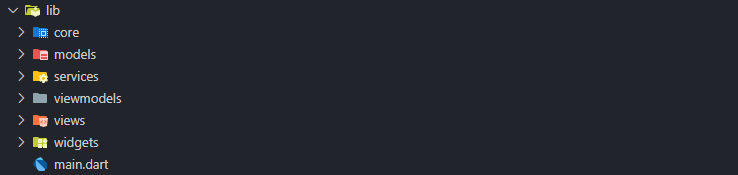

# 📱 Flutter TikTok-like App

Este é um aplicativo desenvolvido em **Flutter** com arquitetura **MVVM**, inspirado em plataformas de vídeo vertical como TikTok. Os vídeos são consumidos via **AT Protocol** (`atproto`), e reproduzidos automaticamente conforme o usuário navega verticalmente.

---

## ✨ Funcionalidades

- 🎥 Scroll vertical infinito de vídeos curtos
- 🔄 Reprodução automática do vídeo atual e pausa dos demais
- 👤 Exibição do nome do autor e avatar
- 📝 Exibição da descrição do vídeo
- ⚙️ Arquitetura escalável utilizando o padrão **MVVM**
- 🪝 Consumo de dados em tempo real com `atproto`
- 📦 Gerenciamento de estado com `Provider`
- ⚡ Requisições otimizadas com `Dio`

---

## 🧱 Arquitetura

Este projeto segue o padrão MVVM (Model-View-ViewModel), que organiza o código em camadas bem definidas, separando responsabilidades entre a apresentação, a lógica de estado e o acesso a dados.

A estrutura do projeto é a seguinte:


### 🔹 **Estrutura de Diretórios**



### 🔄 Camadas da Arquitetura MVVM

#### **View (`views/`)**
Contém as telas do app. São responsáveis por exibir a interface do usuário e escutar mudanças dos **ViewModels**.  
**Exemplo:** `HomeView`.

#### **ViewModel (`viewmodels/`)**
Gerencia o estado da interface e atua como ponte entre a **View** e o **Service**.  
Usa `ChangeNotifier` para notificar a UI sobre atualizações.  
**Exemplo:** `VideoViewModel`.

#### **Model (`models/`)**
Define as estruturas dos dados que trafegam na aplicação, geralmente refletindo a resposta de APIs.  
**Exemplo:** `VideoModel`.

#### **Service (`services/`)**
Realiza chamadas para fontes externas de dados, como APIs REST ou WebSockets.  
**Exemplo:** `VideoService` que utiliza `atproto` para buscar vídeos.

#### **Widget (`widgets/`)**
Componentes visuais reutilizáveis e independentes, utilizados dentro das **views**.  
**Exemplo:** `VideoItemWidget`.

#### **Core (`core/`)**
Inclui configurações, constantes, temas e funções utilitárias de uso geral em todo o projeto.

#### **main.dart**
Arquivo principal onde a aplicação é inicializada.  
Aqui são configurados os provedores globais, como o `Provider` para injeção de dependência e gerenciamento de estado.

## ▶️ Como rodar o projeto no Android Studio com Emulador

### **Pré-requisitos**

- **Android Studio instalado**
- **Flutter SDK** configurado no seu ambiente
- Um **dispositivo virtual (emulador)** configurado no Android Studio
- Uma **conta** no [Bluesky](https://bsky.social/)

### **Passo a passo**

#### 1. **Clone o repositório**

```bash
git clone https://github.com/seu-usuario/seu-projeto.git
cd seu-projeto
```

#### 2. **Abra o projeto no VSCode**

- Vá em File > Open... e selecione a pasta do projeto
- Aguarde o Visual Code sincronizar os pacotes automaticamente

#### 3. **Instale as dependências do projeto**

```bash
flutter pub get
```

#### 4. **Abra o Arquivo VideoService.dart**

- No arquivo, vá até a linha **17** e altere **email@gmail.com** para o seu email de login na plataforma **Bluesky**
- Depois na linha **18** altere **PASSWORD** para o sua senha de login na plataforma **Bluesky**

#### 4. **Inicie um emulador Android**

- Abra o **Android Studio**
- Vá até a aba **Device Manager**
- Clique em **Play** no dispositivo virtual desejado

#### 5. **Execute o app**

Você pode executar o app da seguinte forma:

```bash
flutter run
```

E selecionar o novo dispositivo chamado Android.